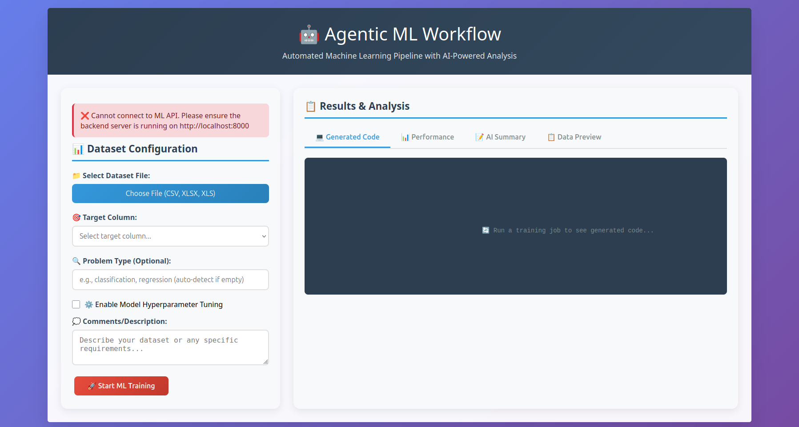
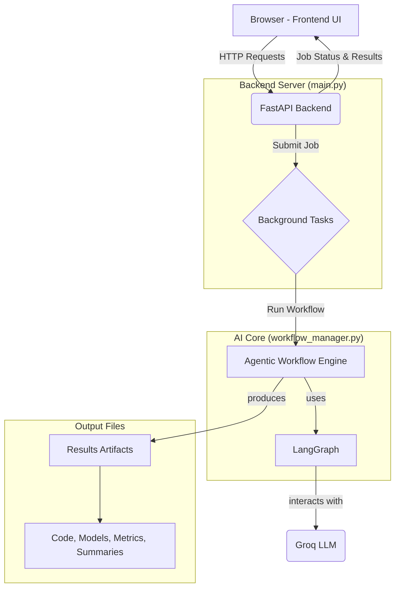
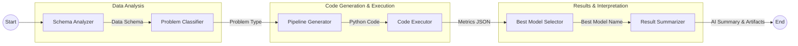

Of course! Here is a detailed and well-structured `readme.md` file for your AutoDS project, complete with explanations, diagrams, and instructions suitable for a GitHub repository.

---

# AutoDS: The Agentic Machine Learning Workflow

[](https://opensource.org/licenses/MIT)
[](https://www.python.org/downloads/)
[](https://fastapi.tiangolo.com/)
[](https://github.com/langchain-ai/langgraph)

AutoDS is an intelligent, end-to-end system that automates the entire machine learning lifecycle. By uploading a dataset, users can trigger a sophisticated agentic workflow that analyzes the data, generates a custom ML pipeline, executes it, and delivers a comprehensive, AI-powered analysis of the results.

This project leverages a modern stack including a **FastAPI** backend for robust API services, **LangGraph** to orchestrate the AI agent's workflow, and **Groq** for high-speed LLM inference, all presented through an intuitive web interface.

  
**

---

## ✨ Key Features

*   **Automated Pipeline Generation**: Intelligently generates complete, executable Python code for data preprocessing, model training, and evaluation based on your dataset's unique characteristics.
*   **AI-Powered Analysis**: Automatically determines the problem type (Classification/Regression), selects the best-performing model, and generates a detailed, human-readable summary of the results.
*   **Interactive Web Interface**: A user-friendly, single-page application to upload data, configure training jobs, and explore results without writing a single line of code.
*   **Asynchronous Job Handling**: Leverages FastAPI's background tasks to run ML workflows without blocking the UI, allowing users to submit and forget.
*   **Comprehensive Results**: Delivers multiple artifacts for each job, including:
    *   The generated Python source code.
    *   Performance metrics and model comparisons.
    *   A downloadable, trained model file.
    *   An AI-generated summary report in Markdown.
*   **Scalable Architecture**: Built with production-grade tools like FastAPI, Redis (optional) for job management, and Uvicorn for serving.

---

## ⚙️ Project Architecture

The project is designed with a clear separation of concerns, consisting of a frontend UI, a backend API server, and an AI-powered workflow engine.



1.  **Frontend**: A static HTML/CSS/JS page that provides the user interface for interacting with the system.
2.  **FastAPI Backend**: The central nervous system that exposes RESTful endpoints, handles file uploads, manages job lifecycle, and serves the final results.
3.  **Agentic Workflow Engine**: The core AI component built with **LangGraph**. It orchestrates a series of agents (nodes) that perform specific tasks in a logical sequence.
4.  **Groq LLM**: The Large Language Model that powers the intelligence of the agents, used for code generation, problem analysis, and result summarization.

---

## 🤖 The Agentic Workflow Explained

The heart of AutoDS is a stateful graph managed by LangGraph. When a job is submitted, the workflow progresses through a series of specialized agents, each performing a distinct step of the ML process.



1.  **Schema Analyzer**:
    *   **Input**: Dataset file path.
    *   **Action**: Loads the data using Pandas, analyzes its structure (shape, columns, data types), and identifies numeric/categorical features and missing values.
    *   **Output**: A detailed data schema.

2.  **Problem Classifier**:
    *   **Input**: Data schema (specifically the target column's info).
    *   **Action**: Sends the target column's characteristics (data type, unique values) to the LLM to infer whether the task is `classification` or `regression`.
    *   **Output**: The inferred problem type.

3.  **Pipeline Generator**:
    *   **Input**: Data schema, problem type, target column.
    *   **Action**: Uses a detailed prompt to instruct the LLM to generate a self-contained Python script. This script handles preprocessing, model training (for multiple relevant models), evaluation, and saving the results and models.
    *   **Output**: A clean, executable Python code string.

4.  **Code Executor**:
    *   **Input**: The generated Python code.
    *   **Action**: Executes the script in a separate process. The script saves its output (metrics) to a JSON file.
    *   **Output**: The dictionary of results loaded from the JSON file.

5.  **Best Model Selector**:
    *   **Input**: The dictionary of model metrics.
    *   **Action**: Programmatically identifies the best model based on a primary metric (R² or RMSE for regression, Accuracy for classification).
    *   **Output**: The name of the best-performing model.

6.  **Result Summarizer**:
    *   **Input**: Data schema, metrics, and the best model's name.
    *   **Action**: Instructs the LLM to act as an expert data scientist and write a comprehensive report in Markdown format, explaining the dataset, comparing model performance, and deep-diving into the best model.
    *   **Output**: A detailed Markdown summary.

---

## 🛠️ Technology Stack

*   **Backend**: Python, FastAPI, Uvicorn
*   **AI Orchestration**: LangChain, LangGraph
*   **LLM Provider**: Groq (for Llama 3.1)
*   **ML & Data**: Pandas, Scikit-learn, XGBoost
*   **Frontend**: HTML5, CSS3, JavaScript
*   **Asynchronous Tasks**: `asyncio`, `BackgroundTasks`
*   **Data Serialization**: Pydantic, Orjson
*   **Dependency Management**: pip

---

## 📂 Project Directory Structure

```
AutoDS/
├── backend/
│   ├── ai_summary/           # Stores AI-generated markdown summaries
│   ├── code/                 # Core application logic
│   │   ├── __init__.py
│   │   ├── llm_manager.py    # Manages interaction with the Groq LLM
│   │   ├── ml_config.py      # Configuration for ML models
│   │   ├── pipeline_generator.py # Implements the agent nodes for the workflow
│   │   ├── prompts.py        # Contains all prompts for the LLM
│   │   ├── state.py          # Defines the LangGraph state object
│   │   └── workflow_manager.py # Builds and compiles the LangGraph workflow
│   ├── generated_code/       # Stores the Python scripts generated by the AI
│   ├── logs/                 # Application log files
│   ├── model/                # Stores the trained and zipped model files
│   ├── results/              # Stores the JSON metric files from executions
│   ├── uploads/              # Temporary storage for user-uploaded datasets
│   └── main.py               # FastAPI application entry point, defines all API endpoints
├── frontend/
│   └── index.html            # The single-page web interface for the application
├── requirements.txt          # Python dependencies for the project
└── readme.md                 # This file
```

---

## 🚀 Getting Started

Follow these instructions to set up and run the project locally.

### 1. Prerequisites

*   Python 3.9+
*   A Groq API Key

### 2. Installation

1.  **Clone the repository:**
    ```bash
    git clone https://github.com/your-username/AutoDS.git
    cd AutoDS
    ```

2.  **Create and activate a virtual environment:**
    ```bash
    # For Windows
    python -m venv venv
    .\venv\Scripts\activate

    # For macOS/Linux
    python3 -m venv venv
    source venv/bin/activate
    ```

3.  **Install the required Python packages:**
    ```bash
    pip install -r requirements.txt
    ```

4.  **Set up environment variables:**
    Create a file named `.env` in the root directory of the project and add your Groq API key:
    ```
    GROQ_API_KEY="your_groq_api_key_here"
    ```

### 3. Running the Application

1.  **Start the backend server:**
    Navigate to the `backend` directory and run the Uvicorn server:
    ```bash
    cd backend
    uvicorn main:app --host 0.0.0.0 --port 8000
    ```
    The API will now be running at `http://localhost:8000`.

2.  **Launch the frontend:**
    Navigate to the `frontend` directory and open the `index.html` file in your web browser.
    ```bash
    cd frontend
    # On Windows
    start index.html
    # On macOS
    open index.html
    # On Linux
    xdg-open index.html
    ```

---

## 📖 How to Use

1.  **Upload a Dataset**: Click "Choose File" and select a CSV or XLSX file from your local machine.
2.  **Select Target Column**: Once the file is loaded, the "Target Column" dropdown will be populated with the columns from your dataset. Select the column you want to predict.
3.  **Configure Options (Optional)**:
    *   **Problem Type**: Leave this blank for auto-detection, or specify `classification` or `regression`.
    *   **Enable Tuning**: Check this box to perform hyperparameter tuning (this will increase processing time).
    *   **Comments**: Provide any notes or context about your data to guide the AI.
4.  **Start Training**: Click the "Start ML Training" button.
5.  **Monitor Progress**: The status section will appear, showing the current state of the job (Pending, Running, Completed, or Failed) and a progress bar.
6.  **Explore Results**: Once the job is complete, the output tabs will be populated:
    *   **Generated Code**: View the Python script created by the AI and download it.
    *   **Performance**: See key metrics and a comparison of all trained models.
    *   **AI Summary**: Read the detailed analysis report generated by the AI. You can download this report, along with the final trained model.
    *   **Data Preview**: View the first few rows of your uploaded dataset.

---

## 📜 API Endpoints

For advanced users, the FastAPI backend provides the following key endpoints:

| Method | Endpoint                    | Description                                       |
| :----- | :-------------------------- | :------------------------------------------------ |
| `POST` | `/train`                    | Submits a new training job with a dataset file.   |
| `GET`  | `/jobs/{job_id}`            | Retrieves the status and results of a specific job. |
| `GET`  | `/jobs`                     | Lists all submitted jobs.                         |
| `GET`  | `/jobs/{job_id}/code`       | Downloads the generated Python code for a job.    |
| `GET`  | `/jobs/{job_id}/results`    | Downloads the JSON results file for a job.        |
| `GET`  | `/jobs/{job_id}/ai_summary` | Downloads the AI-generated summary for a job.     |
| `GET`  | `/jobs/{job_id}/model`      | Downloads the final trained model as a zip file.  |
| `GET`  | `/health`                   | Health check for the API service.                 |

---

## 🤝 Contributing

Contributions are welcome! If you'd like to improve AutoDS, please feel free to fork the repository and submit a pull request.

1.  Fork the Project
2.  Create your Feature Branch (`git checkout -b feature/AmazingFeature`)
3.  Commit your Changes (`git commit -m 'Add some AmazingFeature'`)
4.  Push to the Branch (`git push origin feature/AmazingFeature`)
5.  Open a Pull Request

---

## 📄 License

This project is distributed under the MIT License. See the `LICENSE` file for more information.